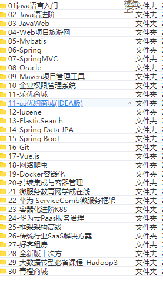
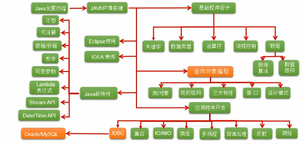
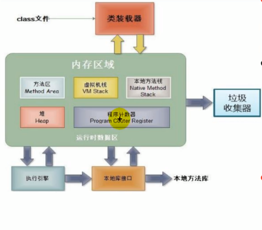
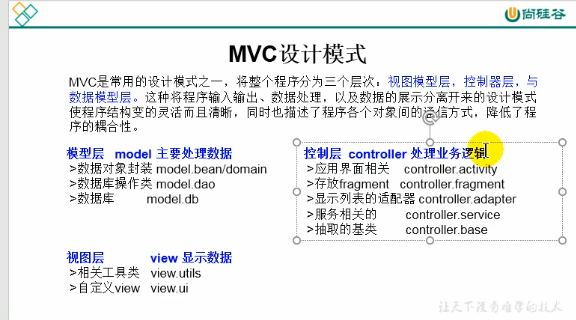
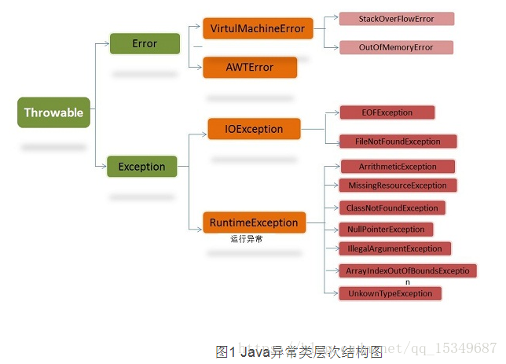

# 						JAVASE

## 学习路线

JavaSE --> MySQL基础 --> JDBC --> JavaWeb --> Spring5 --> SpringMVC --> MyBatis --> Maven --> Ssm框架整合案例 --> Git/GitHub --> Redis --> MySQL高级优化 --> MyBatisPlus --> Spring注解驱动开发 -->  ZooKeeper --> Dubbo --> 消息中间件ActiveMQ --> SpringBoot2-->  SpringCloud --> 尚筹网项目 --> 在线教育项目 --> 谷粒商城项目 --> 高频面试题第一季 --> 大厂面试题第二季 --> 大厂面试题第三季 
作者：尚硅谷
https://www.bilibili.com/read/cv5216534
出处： bilibili

​	1~176基础 177~n面向对象

黑马19年Java全套 全套高清 (IDEA)



[01java语言入门](javascript:;)

[02-Java语进阶](javascript:;)

[03-JavaWeb](javascript:;)

[04-Web项目旅游网](javascript:;)

[05-Mybatis](javascript:;)

[06-Spring](javascript:;)

[07-SpringMVC](javascript:;)

[08-Oracle](javascript:;)

[09-Maven项目管理工具](javascript:;)

[10-企业权限管理系统](javascript:;)

[11-乐优商城](javascript:;)

[11-品优购商城(IDEA版)](javascript:;)

[12-lucene](javascript:;)

[13-ElasticSearch](javascript:;)

[14-Spring Data JPA](javascript:;)

[15-Spring Boot](javascript:;)

[16-Git](javascript:;)

[17-Vue.js](javascript:;)

[18-网络爬虫](javascript:;)

[19-Docker容器化](javascript:;)

[20-持续集成与容器管理](javascript:;)

[21-微服务教育网学成在线](javascript:;)

[22-华为 ServiceComb微服务框架](javascript:;)

[23-容器化进阶K8S](javascript:;)

[24-华为云Paas服务治理](javascript:;)

[25-框架架构高级](javascript:;)

[26-传统行业SaaS解决方案](javascript:;)

[27-好客租房](javascript:;)

[28-全新版十次方](javascript:;)

[29-大数据转型必备课程-Hadoop3](javascript:;)

[30-青橙商城](javascript:;)


## 一丶基础知识

### （一）. 基础

​	1.JDK,JRE,JVM三者之间的关系，以及JDK,JRE包含的主要结构

​		JDK = JRE +JAVA的开发工具

​		JRE = JVM + JAVA核心类库

​	2.为什么配置PATH环境变量

​		让JAVA程序可以在任何路径运行。

​	3.常用的命令指令cmd

​		cd 找路径

​		md创建文件目录

​		rd 删除

​		del 删文件

​		cd.. 退回上一层

​		cd/退回到盘符根目录

​		copy 路径下文件 目标路径   copy C:\1\mima.txt C:\2\ 拷贝文件 

​		del 目标路径下文件      del C:\1\3\TCP.txt  删除文件

   	 del c:\1  删除c盘1目录所有文件  看见没mima.txt被删除了 但是3这个文件夹还没删除
   	                   只是文件不会删除ghost里
   	                   其他文件夹里的东西。

​		dir 文件夹名字或盘符     dir c:\windows 查看C盘windows里目录文件

​		exit： 推出dos命令行

​	3.创建java程序helloworld

​		创建project，class

```java
package Javase;

public class HelloWorld {
        public static void main(String[] args){
            System.out.println("Hello, World");//sout
        }
}
```

​	4.编译与运行的指令

​		编译：javac + 文件名.java

​		运行：java class名                           

​	5.java基础知识

​		

​	6.程序 = 算法 +数据结构

​	7.JDK

​		下载：官网，github

​	8.JAVA关键字

|                          | 全是小写 |           |           |              |         |        |      |
| ------------------------ | -------- | --------- | --------- | ------------ | ------- | ------ | ---- |
| 数据类型                 | class    | interface | enum      | byte         | short   | int    | long |
|                          | float    | double    | char      | boolean      | void    | String |      |
| 流程控制                 | if       | else      | switch    | case         | default | while  | do   |
|                          | continue | return    |           |              |         |        |      |
| 访问权限                 | private  | protected | public    |              |         |        |      |
| 修饰符（类，方法，变量） | abstract | final     | static    | synchronized |         |        |      |
| 类与类                   | extends  |           |           | implements   |         |        |      |
| 实例                     | new      | this      | super     |              |         |        |      |
| 异常处理                 | try      | catch     | finally   | throw        | throws  |        |      |
| 包有关                   | package  | import    |           |              |         |        |      |
| 修饰符                   | native   | strictfp  | transient | volatile     | assert  |        |      |
| 数据值                   | true     | false     | null      |              |         |        |      |
| 保留字                   | goto     | const     |           |              |         |        |      |


------

​	9.从外设获取输入方法

​		导包：import java.util.Scanner;

​		实例化：Scanner input = new Scanner(System.in);

​		使用：int a = input.nextInt();

### （二）. 变量与运算

​	1.变量定义

​		数据类型 变量名 = 变量值；

​	2.常用范围

​		byte：-128——127；(4)int：-2 ^32 - 2 ^31；(8)long：- 2 ^63 ——2 ^63 -1

​		(4)float: -3.403E38——3.403E38（e 10；(8)double：-1.798E308~1.798E308

​		(2)char：‘ ’ ；

​		boolean：true/false。

​	3.转类型

​		int a；

​		(char)a ；（double）a；

​	4.String

​		不是基本数据类型，属于引用类型。

```java
String s = ”    ”；
```

​		与基本类型运算只会链接成String。

​	5 .进制与码

​		二进制：/b（0b开头） 十进制：/d 八进制 /o 十六进制：/h（0x开头）。

| 原码 | ：   | -14  |      |      |      |      |      |
| ---- | ---- | ---- | ---- | ---- | ---- | ---- | ---- |
| 1    | 0    | 0    | 0    | 1    | 1    | 1    | 0    |
| 反码 |      |      |      |      |      |      |      |
| 1    | 1    | 1    | 1    | 0    | 0    | 0    | 1    |
| 补码 |      |      |      |      |      |      |      |
| 1    | 1    | 1    | 1    | 0    | 0    | 1    | 0    |

​		在计算机底层是以补码的方式存储数据。

​		原码 第一位 是正负，后面代表二进制数，

​		反码 除了第一位其他几位与原码值相反。

​		补码 反码+1就是补码。

​		int a=128; a  = (byte)a;a=-128;

​		-128 ： 0b10000000

6. 运算符

​		算术运算符：+,-,*,/,++,- -,%。

​		赋值运算符：=。

​		位运算符：用于二进制，<<左移*,>>右移/，>>>>无符号右移/，&与(共有)，|或(有)，^异	或（不一样则取），~取反（所有位数取反值（二进制））

​		逻辑运算符：&, |, ！,&&, ||, ^.(^异或运算符即a^b只有a与b异值时为true，同值为false)

​		比较运算符： ==, != ,<,>, <=,>=;instanceof(检查是否是类的对象)

​		三元运算符：（条件表达式）?表达式1：表达式2；

​		eg: int max  = (m > n)?m:n;

### （三）. 流程控制

​	1.三大结构

​		顺序，分支，循环

​	2.分支结构

​		if｛表达式1｝else｛表达式2｝

​		switch（）｛case 1：表达式1；case 2：表达式2；default：表达式3；｝

​	3.循环结构

​		初始化条件，循环条件，循环体，迭代条件。

​		for（初始化条件;循环条件;迭代条件）{循环体 }

​		while(循环条件){循环体，迭代条件。 }or while(true){if(终止条件)｛break;｝}

​		do{ 循环体，迭代条件。} while(循环条件);

​	4.关键字使用

​		break，continue；

​	5.标签使用

​		break label；结束指定标签的一层循环

​		continue label；结束指定标签的一层循环结构的当次循环

### （四） .  数组

​	1.数组的定义

​		属于引用数据类型，元素可以是任何类型，开辟一片连续的空间，长度一旦确定不能更	改，即有索引的集合（0~n-1）。

​	2.一维数组

​		声明：类型[ ] 变量名;//eg:int[ ] ids;

​		初始化：静态初始化：变量名 = new 类型[ ]{0,1,2,3,};//eg:ids = new int[ ]{0,1,2,3};

​		动态初始化：类型[ ] 变量名 = new 类型[1000];//eg:String[ ] s = new String[9];

​		调用指定元素：eg:ids[1]//根据索引找到所对应的元素

​							//charAt(0)调用对应字符串数组的的第i个字符。

​		获取长度：lens = ids.length;

​		遍历数组：for(int i = 0; i < lens; i++){ ids[i];}  or for()

​		默认初始化值：未赋值是默认初始化为0, 0.0,  ‘\0’, false, null

​		复制： arr2 = arr1；

​		相等：data.equals(arr[i])——范围boolean值;

​		内存解析：栈(stack)：局部变量,堆(heap)：new出来的结构(对象，数组),方法区(常量池，静态域 )：(String，static)。

​					栈存放数组的头地址，堆存放数组的具体元素(顺序存储)。

​	3.二维数组

​		声明+初始化：类型[ ] ( 没有空格 ) [ ]  arr = new 类型[1000] (没有空格)[1000];

​		动静态与一位数组类似扩展。

​		调用指定元素：eg：arr[1] [1];

​		获取长度：lens = arr.length;获取的是数组有多少行。即第一个[ ]有多少个。

​		遍历数组：双层循环遍历。

​		默认初始化值：arr[0] 为地址值，arr[i] [j] 与 一位数组相似。 

​		内存解析：栈存放第一列的头地址，第i列指向第i行的头地址。

​	4.实例

​		打印杨辉三角形：

```java
package Javase;

public class Arraydd {
    public static void main(String[] args){
        int[][] arr  = new int[10][10];
        for(int i = 0;i < arr.length; i++){
            arr[i][0] = 1;
            arr[i][i] = 1;
            if(i == 0) continue;
            if(i > 1){
                for( int j = 1;j <= i; j++){
                    arr[i][j] = arr[i-1][j-1] + arr[i-1][j];
                }
            }
        }


        for(int i = 0; i < arr.length; i++){
            for( int j = 0;j <= i; j++){
                System.out.print(arr[i][j]);
            }
            System.out.println();
        }
    }
}
```

​	5.笔试例题

​		创建一个长度为6的int型数组，要求数组元素的值都在1-30之间，且是随机赋值。同时要求元素的值各个不同。

```java
package Javase;

public class Arraydd {
    public static void main(String[] args) {
        int[] arr = new int[6];
        for( int i = 0;i < arr.length; i++){
            arr[i] = (int) (Math.random() * 30) + 1;

            for (int j = 0; j < i; j++){
                if(arr[i] == arr[j]){
                    i--;
                    break;
                }
            }
        }
        for(int i = 0;i < arr.length;i++){
            System.out.println(arr[i]);
        }
    }
}
```

​	6.常见算法

​		1数组元素赋值（杨辉三角，回形数）。

​		2求数组中最大值，最小值，平均数，总和。

​		3数组的复制，翻转，查找（线性查找，二分查找）。

​		4数组的排序算法。

​	7.Array类的调用

​		import java.util.Arrays;

​		数组比较：boolean isEquals = Arrays.equals(arr1,arr2);

​		输出数组信息  String toString(int[] a);

​		将指定的值填充到数组：Arrays.fill(arr,10); System.out.println(Arrays.toString(arr1));

​		对数组排序 Arrays.sort(arr);

​		堆排序后的数组进行二分法检索指定的值：int index = Arrays.binarySearch(arr,key);

### （五）.  常用方法

​	1.获取当前时距离1970-01-01 00：00：00的毫秒数

​		start = System.currentTimeMillis();

​		end= System.currentTimeMillis();	

​		显示程序运行时间：（end - start）

​	2.平方根	x.sqrt(i); 

​	3.获取随机数	Math.random() * end +start

​	4.绝对值 	Math.abs()

​	5.排序

​		选择排序，堆排序，冒泡排序，快速排序，

​		插入排序，折半插入排序，Sheel排序，

​		归并排序，桶排序，基数排序。

​		时间复杂度与稳定性：

​							选泡插，

​							快归堆希桶计基，
​							恩方恩老恩一三，
​							对恩加k恩乘k，
​							不稳稳稳不稳稳，
​							不稳不稳稳稳稳。

### （六）.数据结构

​	1.时间复杂度空间复杂度

​	2.线性结构与链式结构

​	3.链表

​	4.队列

​	5.栈

​	6.堆

​	7.字符串

​	8.二叉树

​	9.图论


### （七） .算法

#### 			1.算法特征

​			输入，输出，有穷性，确定性，可行性。

#### 		2.算法的策略

​			二分，递归，贪心，动规

#### 		3.二分策略

##### 			（1）二分查找

##### 			（2）快速排序


------


## 二丶面向对象，上

### （一） .面向对象（OOP）与面向过程(POP)

​		POP强调的是功能行为，以函数为最小单位，考虑怎么做。

​		OPP强调具备了功能的对象，以类、对象为最小单位，考虑谁来做。

### （二）.面向对象的思路与步骤

​	1.根据问题，选择实体

​	2.从实体中找解决问题的属性和功能，即类。

​	3.抽象到计算机中的类，借助程序语言，把类构造成计算机能够识别和处理的数据结构。

​	4将类实例化成对象，对象是解决问题的最终工具。

### （三）.类与对象的创建

​	1.概念

​		类，是对一类事物的描述，是抽象的，概念上的定义。

​		对象，是世界存在的该事物的个体，也成为实例（instance）。

​	2.设计类就是设计类的成员

​		class 类名{

​		}

​	3.属性与方法

​		Field = 属性 = 成员变量 =域、字段

​		Method = 方法（成员） = 函数

​		eg：行为表现为方法

​		属性：身高体重个人信息

​		行为：唱跳Rap篮球

​	4.类和对象的创建与调用

​		eg：人把大象装冰箱里

​		（1）.创建类

```java
public class Person {
    //属性
    String name;
    int age = 22;
    boolean isMale;
    
    //方法
    public void eat(){
        System.out.println("吃饭。");
    }
    public void sleep(){
        System.out.println("睡觉。");
    }
    public void  talk(String language){
        System.out.println("可以用"+language+"说话。");
    }

}
```

​		（2）.创建Person类的对象

```java
//测试类
public class PersonTest {
    public static  void main(String[] args){
        //创建Person类的对象
        Person p1 = new Person();
        
    }
}
```

​		（3）.调用方法与成员

```java
public class PersonTest {
    public static  void main(String[] args){
        //创建Person类的对象
        Person p1 = new Person();
        //调用对象的结构，属性，方法
        p1.name = "Tom";
        p1.isMale = true;
        System.out.println(p1.name+" "+p1.age);
        
        //调用方法，“对象.方法”
        p1.eat();
        p1.sleep();
        p1.talk("Chinese");
    }
}
```

​	5.多个对象的关系

​		有多个对象时，对象与对象之间互相独立，独立拥有一套类的属性（非static）。

​		修改一个对象的属性不会影响另一个对象的属性。

​		对象之间可互相复制属性值。p2 = p1,p2完整的复制了p1的所有属性，即p1与p2指向同一个实体的地址。

​	6.内存解析

​		

​		heap（堆）存放对象实例、stack（栈）存放局部变量。方法区（Method Area），储存已被加载类信息，常量，静态变量，编译后的代码等数据。

### （四）.类中的属性

​	1.类中属性（成员）的使用

​		（1）.属性与局部变量

​				属性，直接定义在类的｛｝内

​				局部变量，声明在方法内，方法形参，代码块内，构造器形参，构造器内部的变量。

​		（2）.只有成员可以用权限修饰符（public，private，缺省，protected）

​		（3）.初始化值的情况

​				对于类的属性与其基本初始化值一致。

​				对于局部变量没有初始化值，即调用时必须赋值。（仅针对于类）


### （五）.类中的方法

​	1.方法的定义

​		具有特定功能的一个代码块。

​	2.方法的声明

​		权限修饰符 返回值类型 方法名（形参）｛

​			方法体；		

​		｝

​		eg：

```java
public void sleep(){
    System.out.println("睡觉。");
}
```

​	3.权限修饰符

​		public，private，缺省，protected。定义使用权限。详见封装。

​	4.返回值类型

​		void ： 通常不使用return。一旦使用表示结束此方法。（return；）

​		其他类型： 使用与方法声明中的返回值类型一致的返回值返回。（return 返回值；）

​		如何选择是否有返回值：看经验，看题目要求，具体情况具体分析。

​	5.方法名

​		遵循aaaaaBbbbbCccc定义规则命名，要求见名知意。

​	6.形参

​		可声明零个至多个形参，以“，”隔开，根据题目要求和经验以及题目要求。

​	7.return使用

​		使用在方法体中，作用：①结束一个方法，②返回返回值。

​	8.方法

​	可调用同一个类的其他方法，可递归。

### （六）.万事万物皆对象

### （七）.对象数组

​	类似于C++结构体数组。

### （八）.匿名对象的使用  

​	1.造匿名对象

​			new Person();

​	2.调用方法

​			new Person().eat();

​	3.概念

​			没有显式的对象名，只能调用一次，简单来讲，一次性对象。

​	4.使用

​		PhoneMall mall = new PhoneMall();

​		mall.show(new Phone());

### （九）.重载（overload）

​	1.方法的重载

​		在同一个类中，允许存在一个以上的重名方法，只要他们的参数个数或者参数类型不同即可。

​	eg:


### （Ⅹ）.封装与隐藏

​	1.高内聚，低耦合

​		高内聚：类的内部数据操作细节自己完成，不允许外部干涉。

​		低耦合：仅对外暴露少量的方法用与完成。

​	2.封装的定义

​			隐藏对象内部的复杂性，只对外公开简单的接口，便于外界调用，从而提高系统的可		扩展性，可维护性，通俗的说，把该隐藏的隐藏起来，该暴露的暴露出来，这就		是		封装性的设计思想。

​	3.封装的体现

​		①类中属性私有化

​				private 类型 属性名；

​		②编写设置类中变量方法（set属性名）

​				有参无返回

​		③编写在封装后获取属性值的方法（get属性名）

​				无参有返回

​		eg：Animal

```java
package Animal;

public class AnimalTest {
    public static void main(String[] args){
        Animals a = new Animals();
        a.setName("Dog");
        a.setAge(9);
        a.setLegs(6);
        a.show();
        System.out.println(a.getName());
        System.out.println(a.getAge());
        System.out.println(a.getLegs());
    }
}
class Animals{
    private String name;
    private int age;
    private int legs;

    public void setLegs(int legs) {
        if(legs >= 0 && legs % 2 == 0){
            this.legs = legs;
        }else{
            this.legs = 0;
        }
    }

    public int getLegs() {
        return legs;
    }

    public void setAge(int age) {
        if(age >= 0){
            this.age = age;
        }

    }

    public int getAge() {
        return age;
    }

    public void setName(String name) {
        this.name = name;
    }

    public String getName() {
        return name;
    }

    public void eat(){
        System.out.println("吃");
    }
    public void show(){
        System.out.println("name: "+name+" age： "+age+" legs: "+legs);
    }
}

```

​		④方法的私有化也是封装性的体现

​	4.四大权限修饰符的阐述

​		①四种权限（从小到大）

| 修饰符    | 类内部 | 同一个包 | 不同包的子类 | 同一个工程 |
| --------- | ------ | -------- | ------------ | ---------- |
| private   | ✔      |          |              |            |
| 缺省      | ✔      | ✔        |              |            |
| protected | ✔      | ✔        | ✔            |            |
| public    | ✔      | ✔        | ✔            | ✔          |

​		②用途

​			用来修饰类及类的内部结构；属性，方法，构造器，内部类。

​		③具体

​			用来修饰类：缺省、public

### （十一）.构造器

​	1.constructor的作用

​		创建类的对象 类名 对象 = new 构造器；

```java
Scanner input = new Scanner(System.in);
```

​	2.说明

​		①如果没有显式的定义类的构造器的话，则系统默认提供一个空参的构造器。

​		②定义构造器的格式， 权限修饰符 类名（形参列表）｛｝。

​		③一个类中定义的多个构造器，彼此构成重载。

​		④一旦我们显式的定义了类的构造器，系统不再提供默认的构造器。

​		⑤一个类中至少要有一个构造器。

​	eg：

```java
//无参构造器
public Person(){  
}
//有参构造器
public Person(String name){
    this.name = name;
}
```

​	3.构造器执行步骤

​		1将类变量初始到缺省值。（byte, short, int, long, float, 和 double 变量会默认设为它们		相应的0值，booleans 会被设为 false, chars 会被设为空字符('\u0000')，对象引用会被		设为 null）

​		2引用父类的构造器，如果没有定义任何构造器。
​		3将实例变量初始化到指定值。
​		4执行构造器内的代码。

​	4.JavaBean

​		一种Java语言携程的可重用的组件

​		满足以下标准的类即为JavaBean：

​			→类是公共的

​			→有一个无参的公共的构造器

​			→有属性，且有对应的get、set方法

### 	（十二）.UML


​	GeelyClass：类名

​	类名的水平分割线下是属性，属性的水平分割线下是方法。

​	+：public；-：private；#：protected；~：缺省；

​	方法的写法：类型 方法名（参数名：参数类型）：返回值类型

​	有下划线的方法是为构造器。

### （十三）.关键字：this的使用

​	this首先是一个对象,它代表调用这个函数方（方法）的对象。this表示当前对象。

​	就近原则：编译器优先考虑近的声明

​	如果方法（构造器）的形参和类的属性重名时，我们需用this.变量表示这个变量是属性，不是形参。

​	this(构造器的参数)可调构造器减低代码冗余。

```java
private String name;
private int age;

public Animals(){

}
public  Animals(int age){
    this();
    this.age = age;
}
public Animals(int age, String name){
    this(age);
    this.name = name;
}
```

​	this（）不能调自身的构造器，且只能放在该构造器的首行。 只能调一个。

​	this单独使用表示调用当前对象。

### （十四）.关键字：package、import使用

​	1.package：包

​		使用包有两个好处:
 		可以减少类命名的冲突，便于管理.
 		可以将共同实现某一特定功能的一些类定义绑定到一起.

​		声明类和接口所在的包，在一个类里的首行。

​		包的声明要小写，每一个.代表一层文件。

​		同一个包下不能命名重名的接口或类。

​	2.MVC设计模式



​		经典MVC模式中，M是指业务模型，V是指用户界面，C则是控制器，使用MVC的目的		是将M和V的实现[代码](https://baike.baidu.com/item/代码/86048)分离，从而使同一个程序可以使用不同的表现形式。其中，View		的定义比较清晰，就是用户界面


视图

视图是用户看到并与之交互的界面。对老式的Web应用程序来说，视图就是由[HTML](https://baike.baidu.com/item/HTML)元素组成的界面，在新式的Web应用程序中，[HTML](https://baike.baidu.com/item/HTML)依旧在视图中扮演着重要的角色，但一些新的技术已层出不穷，它们包括[Adobe Flash](https://baike.baidu.com/item/Adobe Flash)和像[XHTML](https://baike.baidu.com/item/XHTML)，[XML](https://baike.baidu.com/item/XML)/[XSL](https://baike.baidu.com/item/XSL),[WML](https://baike.baidu.com/item/WML)等一些标识语言和[Web services](https://baike.baidu.com/item/Web services).

MVC好处是它能为应用程序处理很多不同的[视图](https://baike.baidu.com/item/视图)。在视图中其实没有真正的处理发生，不管这些数据是联机存储的还是一个雇员列表，作为视图来讲，它只是作为一种输出数据并允许用户操纵的方式。 [6] 

模型

模型表示企业数据和业务规则。在MVC的三个部件中，模型拥有最多的处理任务。例如它可能用像[EJB](https://baike.baidu.com/item/EJB)s和ColdFusion Components这样的构件对象来处理数据库，被模型返回的数据是中立的，就是说模型与数据格式无关，这样一个模型能为多个视图提供数据，由于应用于模型的代码只需写一次就可以被多个视图重用，所以减少了代码的重复性。 [6] 

控制器

控制器接受用户的输入并调用模型和视图去完成用户的需求，所以当单击Web页面中的超链接和发送[HTML表单](https://baike.baidu.com/item/HTML表单)时，控制器本身不输出任何东西和做任何处理。它只是接收请求并决定调用哪个模型构件去处理请求，然后再确定用哪个视图来显示返回的数据。 [6]

3.import

​	在源文件中显式的使用import结构导入指定包下的类，接口。

​	eg：

```java
import java.util.Arrays;
ArrayList list = new ArrayList();
```

如果使用的接口是java.lang.*;包下的或者本包下的都可以省略不用声明；

如果在源文件中使用了不同包下的同名的类则必须有一个使用全类名的写法，

```java
 java.util.Scanner input= new java.util.Scanner(System.in);
```

4import static 

导入指定类或接口的静态结构：属性或方法。

## 三丶面向对象，中

### 	（一）继承性

​		1.继承性的概念

​			子承父业（继承父类的属性，方法）

​			extend： 延展，扩展

​		2.格式

​		A：子类，派生类（subclass） ，B：父类，超类（superclass）

```java
public class A extends B{
    
}
```

​		3.继承性好处

​			减少代码冗余，提高复用性，便于功能扩展，为多态性提供前提。

​			A extend B 之后，A获取B中的结构，属性，方法。

​			仍可声明自己特有的属性与方法，实现功能的拓展。

​		4.继承的规定

​			JAVA只支持单继承和多层继承，不允许多重继承。

​			一个子类只有一个父类，一个父类可以派生出多个子类。

### （二）Object类

​		1、Object

​			所有的java类都直接或间接的继承（java.lang.Object）类。

​		2、Object 类 的所有方法具有通用性。

​		3、只有一个空参构造器，没有属性

​		4、常用方法

​			①clone（）；复制一个对象。类名 对象名1 = (类名)对象名2.clone();

​			②equals（）；比较两个对象是否相等。

​					== 可用于基本数据类型变量和引用数据类型变量返回布尔值（不一定同类型）

​						char型的值加‘ ’代表ASCLL值 不带‘ ’则为整型。

​						引用类型变量：比较两个对象的地址值是否相同。是否指向同一地址（一个					new 新引用一个地址储存数值）。

​					equals(); 是一个方法，不适用于基本数据类型变量。只用于引用数据类型。

```java
//import java.util.*;
public class Main {

    public static void main(String[] args) {

      //  Scanner scan = new Scanner(System.in);
        
        String s = new String("Zhao") ;
        if(s.equals("Zhao")){
            System.out.println("Nice!");
        }

    }
}
/**
*Object类中定义的equals（）的作用于 == 相同 ，比较两个对象的地址是否相同
* public boolean equals(Object obj) {
*       return (this == obj);
*   }
*/
```

​			String、Date、File、包装类中重写了equals（）方法，重写后比较的不是两个地址是否相等，比较的是两个属性的值是否相等。

​			重写equals() ,eg:String类: 

```java
  public boolean equals(Object anObject) {
        if (this == anObject) {
            return true;
        }
        if (anObject instanceof String) {
            String aString = (String)anObject;
            //比较两个对象的每个属性是否相同。
            if (coder() == aString.coder()) {
                return isLatin1() ? StringLatin1.equals(value, aString.value): StringUTF16.equals(value, aString.value);
            }
        }
        return false;
    }
```

​			alt+insert：选择equals 自动生成equals（）方法。

​			③getClass（）；获取当前对象的类。

​			④hashCode（）；获取对象的哈希值。

​			⑤toString（）；

​				当我们输出一个对象的引用时，就是调用当前对象的toString（）。

​				若没有重写则调用当前类的虚拟地址值。：类名+@+十六进制hashCode地址。

​				重写后，使得调用对象的toString()时，返回“实体内容”信息。

​				Object的toString():

```java
   public String toString() {
        return getClass().getName() + "@" + Integer.toHexString(hashCode());
    }
```

​			重写后的toString():eg：Person类：

```java
@Override
public String toString() {
    return "Person{" +
            "name='" + name + '\'' +
            ", age=" + age +
            ", isMale=" + isMale +
            '}';
}
```

​	alt+insert：选择toString 自动生成toString（）方法。

### （三）方法的重写（override）

​		1.定义

​			在子类中根据需要对从父类中继承的方法进行改造，也称为方法的重置，覆盖。在执			行时，子类的方法会覆盖父类的方法。（方法名和形参列表需要一致，方法体重写）

​		2.规定

​			权限修饰符 返回值类型 方法名（形参列表）{

​					//方法体

​			}//子类中叫重写的方法，父类中的叫做被重写的方法。

​		①方法名和形参列表需要一致，方法体重写

​		②重写的方法权限修饰符不小于被重写的方法。

​		③返回值类型只能与被重写的方法的返回值类型一致或是它的返回值类型的子类。

### （四）关键字：super的的使用

​		1*.“super.”*：父类的。。。。。，*“this.”*：当前类的。。。。。。。。

​		2.super可以用来调用：属性，方法，构造器。

​		3.区分同名父子属性。想在子类中调用父类中生民更多属性。

​		4调用构造器

​			声明：super（形参）；

​			若括号内为空，则调用父类的无参构造器，反之，调用带有形参列表的构造器。

​			可以在子类构造器中显式的使用它，调用父类中声明的指定构造器。

​			必须声明在子类构造器的首行，（在类的构造器中，this（），super（）只能二选			一）。

​			在构造器的首行，未显式声明时，默认调用super（）;

### 	（五）子类对象实例化的全过程

​			1.结果上来看：子类继承父类以后获取了父类中声明的属性或方法。常见子类的对			象，在堆空间中，加载所有父类声明的属性。

​			2.过程上来看：通过子类的构造器创建子类对象时，一定会之间或或间接的调用父类的构造器，进而调用父类的父类的构造器，直到调用到Object类中的空参构造器位置。

### 	（六）多态性

​			1.Polymorphism（多态性）

​				一个事物的多种形态。（编译看左，运行看右）

​			2.多态性的定义

​				对象的多态性，父类的引用指向子类的对象(子类的对象赋给父类的引用)

```java
Person p1 = new Man();
```

​			3.多态的使用

​				①.调用子父同名同参的方法时，实际执行的时子类重写父类的方法（虚拟方法调				用）

```java
p1.eat();
p1.walk();
```

​				②.(只能调用父类声明过的方法在子类重写或未重写的方法)

​				③.编译看左，运行看右

​			4.前提：类有继承关系，方法的重写。

​			5.因为属性不能重写，所以对象的多态不适用与属性。

​				故对象的多态，只适用于方法。

​			6.虚拟方法调用（Virtual Method Invocation）

​				多态下，子父同名同参，父类被称为虚拟方法。父类根据赋给它的不同子类对象，动态调用它的不同子类对象，在编译期间无法确定。

​			7.多态是运行时行为。

​			8.编译时是父类的方法，运行时是子类的方法，这就是动态绑定。

​			9.在编译时确定了所要调用的方法，这是静态绑定。

​			10.Bruce Lee ：“拥有动态绑定的才是多态。”

​			11.instanceof操作符使用

​				 多态（向上转型），instanceof（向下转型）：可调用子类中独有的方法与属性。

```java
//向下转型
Person p2 = new Man;
Man m1 = (Man)p2;
```

​				使用强转是可能会出现ClassCastException的异常。

​				A instanceof B：判断对象A时否是类B的实例。

​	

```java
if(A instance B){
	Woman w = (Woman)p1;
	w1.goShopping();
	System.out.println("13213212");
}
```

### 	（七）单元测试方法

​			Java的单元测试：

​			1,加载JUnit 4 or 5

​			2,创建类，这个类是公共的，这个类提供公共的无参构造器。

​			3,单元测试方法：此方法为公共的，没有返回值，没有形参

​			通用格式：@Test

​								public void test测试内容(){

​								}

​			需要导入import org.junit.Test;包。

​			4.Run 该方法

​				红色代表有异常，绿色代表没有异常。

### 	（八）包装类 

​		1.Wrapper(包装类)

​			Byte、Short、Integer、Long、Float、Double、Boolean、Character。

​		2.将八大基本能数据类型封装成类——引用类型。使得基本数据类型拥有类的特性。

​		数值型的包装类继承于Number类。

​		3.基本数据类型、包装类、String类之间的互相转换

```java
//1--->2 
int aa=4;
Integer a = new Integer(aa);
System.out.println(a.toString());

//2--->1
IInteger a = new Integer("4");
int b = a.intValue();
System.out.println(b);

//1，2--->3、、2同1理
//1连接运算
int num1 = 10;
String str1 = num1+"";
//2调用Streing重载的valueOf（XXX xxx）
float f1 = 12.3f;
String str2 = String.valueOf(f1);//12.3

//3--->1,2
//调用包装类的parseXxx（）可能会报NumberFormatException
String str1 = "123";
int num1 = Integer.parseInt(str1);
```

​		4.自动装箱与自动拆箱

​			基本类型与包装类新特性（jdk 5之后）。

```java
//自动装箱（无需new对象）
int num = 10;
Integer in1 = num;
//自动拆箱(无需XXXValue（）)
int num2 = in1;
```

​		5.面试题

```java
//下面输出结果有什么不同
//1
Object o1 = true ? new Integer(1):new Double(2.0);
System.out.println(o1);
//三元运算符结果的两种类型必须统一，也就是Integer会升型成Double，故结果为1.0
Object o2;
if(true) o2 = new Integer(1);
else o2 = new Double(2.0);
System.out.println(o2);
//if else 无需统一两个结果的数据类型。故为1

//2
 @Test
    public void test(){
        Integer i = new Integer(1);
        Integer j = new Integer(1);
        System.out.println(i == j);//false

        Integer m = 1;
        Integer n = 1;
        System.out.println(m==n);//true
        //Integercache() Integer[] realm:-128 —— 127
        //128不在IntegerCache里 属于new的对象存在堆空间里x的地址与y不同因此返回false
        Integer x = 128;
        Integer y = 128;
        System.out.println(x == y);//false
    }
```

​			 

------

## 四丶面向对象，下

### 	（一）static

​			1、static ：静态的

​			2、static可以用来修饰：属性、方法、代码块、内部类。

​			3、static修饰属性：静态变量

​				3.1静态属性 VS 实例变量。创建的每个对象都拥有一份独立的实例变量。当修改			一个对象中的费静态属性，不会导致其他对象中同属性的修改。而静态属性则是多个			对象共享一个静态属性，当某一个对象修改静态变量时，会导致其他对象调用静态变			量时，返回的结果是修改后的。例如你租房合租后的厕所。

​				3.2随类的加载而加载、早于对象的创建。通过“类.静态变量”or“对象.静态变量”调			用。由于类只加载一次，故静态变量在内存中只存在一份。

​			4.使用static修饰方法：静态方法

​				4.1随类的加载而加载、早于对象的创建。通过“类.静态方法”or“对象.静态方法”调			用。

​				4.2静态方法中只能使用静态的属性和方法。

​			5.在static中，this，super都不能用。从生命周期的角度理解。

​			6.开发中，如何确定一个属性、方法是否要声明static

​				6.1不会随着对象不同而不同的，可以被多个对象所共享的。

​				6.2工具类中的方法习惯上声明为static的。such：Math，Arrays，Collections。

​			7.单例设计模式（Singleton）

​				7.1采用一种方法使某个类在整个软件系统中只能存在一个对象实例。

​				7.2如何实现

​					//饿汉式

​					①私有化类的构造器

​					②内部创建类的对象且私有化且静态。

​					③提供公共的静态方法，返回类的对象。

```java
//饿汉式
public class Singleton {
    public static void main(String[] args){
        Bank b = Bank.getInstance();
        Bank c = Bank.getInstance();
        System.out.println(b==c);
    }
}
class Bank{
    private Bank() {

    }
    private static Bank instance = new Bank();

    public static Bank getInstance() {
        return instance;
    }

}

```

​				//懒汉式

​				①私有化类的构造器

​				②内部创建类的对象且私有化且静态。

​				③提供公共的静态方法，返回类的对象。

```java
public class Singleton {
    public static void main(String[]args){
        Order b = Order.getInstance();
        Order c = Order.getInstance();
        System.out.println(b==c);
    }

}
class Order{
    private Order(){

    }
    private static Order instance = null;

    public static Order getInstance() {
        if(instance == null){
            instance = new Order();
        }
        return instance;
    }
}
```

​			7.3区分饿汉式与懒汉式

​				饿汉式：bad：对象加载时间过长，benefit：线程安全。

​				懒汉式：bad：线程是不安全的。benefit：延迟对象的创建

​			7.4优点

​				减少了系统性能开销， 当一个对象需要较多资源，则只生成一个实例，永久驻存			内存的方式解决。

​			7.5应用场景

​				网站的计数器。

​				应用程序的日志应用。

​				数据库连接池。

​				读取配置文件的类。

​				Windows的Task Manager(任务管理器)和Recycle Bin(回收站)。

​				Application。

### 	（二）main方法的使用

​		1.main（）作为程序的入口。

​		2.main（）一个普通的静态方法。 

```java
public static void main(String[]args){
    
}
```

​		3.main（）可以作为与控制台交互的方法

### （三）成员之四：代码块

​		1.代码块（Block）：用来初始化类，对象。

​		 2.只能用static 修饰

​		3.静态代码块与非静态代码块

```java
//非静态代码块
{
	System.out.println("hanmapi");
}
//静态代码块
static{
    
}
```

​		4.静态代码块：内部可有输出语句，且随着类的加载而执行。只执行一次。

​		非静态代码块：内部可有输出语句，随着对象的创建而执行，每创建一个对象就执行一		次。可以在创建对象时，对对象的属性等进行初始化。  

​		5.主要作用：初始化属性，

### （四）final

​		1、final 用来修饰结构，类，方法，变量。

​				final 修饰类 表示该类没有子类。是最终类。

​				final修饰方法，表示方法无法重写。

​				final修饰变量，表示变量拥有固定值了，类似于C的const。只能直接赋值，代码块				赋值，以及构造器中初始化。

​				final修饰局部变量，表示该变量只能初始化，无法赋值，且需要大写所有字母。

​		2.static final ：

​				用来修饰属性与全局常量。

### （五）抽象类与抽象方法

​		1.abstract ：抽象

​		2abstract可以用来修饰结构，属性，方法。

​			eg：

```java
abstract class Person{
            
}
		
```

​		3抽象类不能造对象，抽象类中的构造器用于子类的继承

​		4.abstract修饰方法：抽象方法：只有方法声明没有方法体。具体声明在子类。

```java
public abstract eat();
```

​		5.模板方法设计模式

### （六）接口（Interface）

​		1.接口的使用

​			接口用interface来定义，接口与类是并列的两个结构

​		2.接口的定义

​			2.1 JDK7 ：只能定义全局常量和抽象方法。

​						>全局变量，public static final 类型 属性名 = 常量

​						>抽象方法：public abstract

​			

```java
public class InterfaceTest {
    public static void main(String[] args) {
        Plane p = new Plane();
        p.fly();
    }

}

interface Flyable {
    //全局变量
    public static final int MAX_SPEED = 7900;//第一宇宙速度
    int MIN_SPEED = 1;//public static final 可以省略

    public abstract void fly();

    void stop();
    //public abstract 可以省略
}
class Plane implements Flyable{
    @Override
    public void fly(){
        System.out.println("左脚踩右脚，起飞~！");
    }
    public void stop(){
        System.out.println("停止飞行");
    }
}
```

​			2.2JDK8：新增可定义静态方法，默认方法。

​		3.接口中不能定义构造器，不可以实例化。

​		4.在开发中，接口通过类去实现（implements）

​		5.实现接口的类需要覆盖实现该接口的所有抽象方法。若未实现全部，则需定义为抽象		类 

​		6.Java可实现多个接口，用逗号隔开

```java
class AA extends BB implements CC,DD,EE{

}
```

​		7.接口与接口可以继承，可以多继承。

​		8.接口体现多态性，接口是一种规范（实现类的集合称为驱动）

​		9.代理模式（Proxy）

​		为其他对象提供一种代理以控制对这个对象的访问。

​		10.工厂模式

### （七）内部类

​		1.Java中允许将一个类A声明在类B中，则类A是内部类，类B是外部类。

​		2.分为成员内部类（静态，非静态），局部内部类（方法内，代码块内，构造器内）

​		*------------------------------------------------------完结撒花-------------------------------------------------*

##   五丶异常处理

### （一）异常概述与异常体系结构

​		1.异常概述：将程序执行中发生的不正常情况称为“异常”。（语法错误与逻辑错误不是异常）	

​		2.异常可分为两类，Error与Exception

​		3.Error：java虚拟接无法解决的严重问题。

​				JVM系统内部错误，资源耗尽，StackOverflowError和OOM，一般不便携针对性的		代码进行处理。

​		4.Exception：其他因编程错误或偶然的外在因素导致的一般性问题，可以使用针对性代		码进行处理，Such as：

​			空指针访问，试图读取不存在的文件，网络连接中断，数组角标越界。

​		5.两种解决方案

​			①遇到错误终止程序

​			②编写程序时考虑到错误的检测，错误消息的提示，错误的处理。

​		6.捕获错误最理想是在编译期间。错误分为编译时异常和运行时异常。

​		7.异常体系结构



​			java.lang.Throwable

​					|--------java.lang.Error;

​					|--------java.lang.Exception;

​								|--------编译异常（checked）

​										|--------IOException

​												|--------FileNotFoundException

​										|--------ClassNotFoundException

​								|-------- 运行异常 （unchecked）

​										|--------NullPointerException

​										|--------ArrayIndexOutOfBoundsException

​										|--------ClassCasetExeption

​										|--------NumberFormatException

​										|--------InputMismatchException

​										|--------ArithmeticException

### （二）异常处理机制

​		1.两种方式：报错与抛出处理。

​		2.方式一：try-catch-finally

​			抓抛模型

​			过程一：“抓”：在方法抛出异常之后，运行时系统将转为寻找合适的异常处理器			（exception handler）。潜在的异常处理器是异常发生时依次存留在调用栈中的方法		的集合。当异常处理器所能处理的异常类型与方法抛出的异常类型相符时，即为合适的		异常处理器。运行时系统从发生异常的方法开始，依次回查调用栈中的方法，直至找到		含有合适异常处理器的方法并执行。当运行时系统遍历调用栈而未找到合适的异常处理		器，则运行时系统终止。同时，意味着Java程序的终止。

​			过程二：“抛”：当一个方法出现错误引发异常时，方法创建异常对象并交付运行时系		统，异常对象中包含了异常类型和异常出现时的程序状态等异常信息。运行时系统负责		寻找处置异常的代码并执行。 

​			对于try-catch-finally语句：先执行try 块中的代码，如果正常运行没有发生异常则执行		完后执行finally 代码块中的代码；如若在try 中发生异常且被catch 捕捉到则执行catch 		中的代码块，然后执行finally 块中的代码。//finally可以不写。若写一定执行。

​		但也存在以下4种特殊情况，finally块不会被执行：

  		 在前面的代码中使用了System.exit()退出程序；
  	
  		在finally语句块中发生异常；
  	
  		程序所在的线程死亡；
  	
  		 关闭CPU。

​			eg：


```java
public class exception4 {
	public exception4() {
	}
    boolean testEx() throws Exception {
        boolean ret = true;
        try {
            ret = testEx1();
        } catch (Exception e) {
            System.out.println("testEx, catch exception");
            ret = false;
            throw e;
        } finally {
            System.out.println("testEx, finally; return value=" + ret);
            return ret;
        }
    }

    boolean testEx1() throws Exception {
        boolean ret = true;
        try {
            ret = testEx2();
            if (!ret) {
                return false;
            }
            System.out.println("testEx1, at the end of try");
            return ret;
        } catch (Exception e) {
            System.out.println("testEx1, catch exception");
            ret = false;
            throw e;
        } finally {
            System.out.println("testEx1, finally; return value=" + ret);
            return ret;
        }
    }

    boolean testEx2() throws Exception {
        boolean ret = true;
        try {
            int b = 12;
            int c;
            for (int i = 2; i >= -2; i--) {
                c = b / i;
                System.out.println("i=" + i);
            }
            return true;
        } catch (Exception e) {
            System.out.println("testEx2, catch exception");
            ret = false;
            throw e;
        } finally {
            System.out.println("testEx2, finally; return value=" + ret);
            return ret;
        }
    }

    public static void main(String[] args) {
        exception4 testException1 = new exception4();
        try {
            testException1.testEx();
        } catch (Exception e) {
            e.printStackTrace();
        }
    }
}
```
​			3，throws（甩锅）

​					一直抛到main然后try catch。

​			4.开发中若父类没有throws则子类也不能有。

​			5.throw手动抛出异常详细见上代码

​			完结撒花


​			


  


